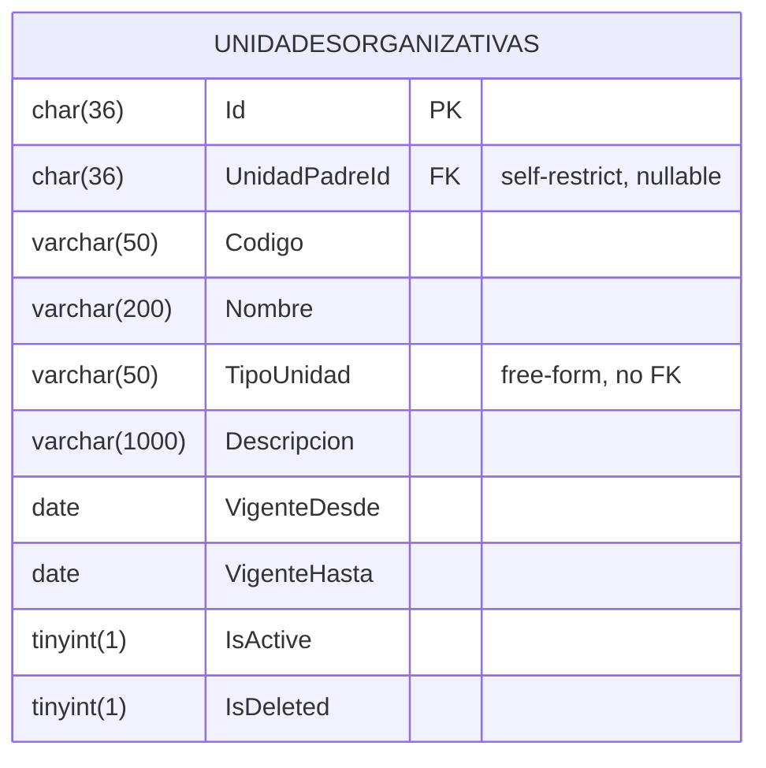
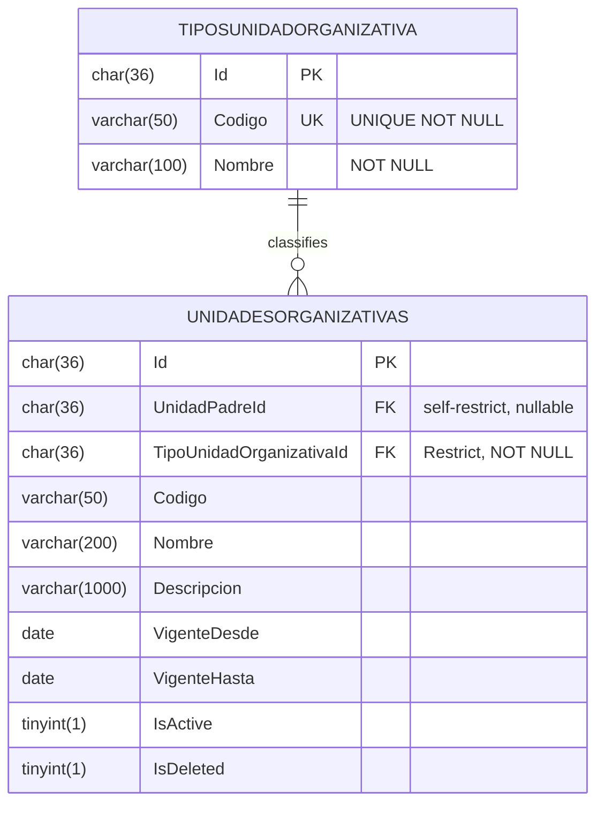

# Design: Replace `UnidadOrganizativa.TipoUnidad` (string) with FK to `TipoUnidadOrganizativa` catalog

> **Status:** Approved-by-orchestrator design (atomic phase output).
> **Change:** `cambiar-campo-tipounidad-a-tabla-tipounidadorganizativa`
> **Phase:** `sdd-design` — produces this file and the 5th spec delta at `specs/sgv-persistence-architecture/spec.md`. Does **not** produce code, does **not** produce `tasks.md`.

## Quick path

1. New domain entity `TipoUnidadOrganizativa` (immutable, no soft delete, no audit) and a new persistence table `TiposUnidadOrganizativa`.
2. New FK column `UnidadesOrganizativas.TipoUnidadOrganizativaId char(36) NOT NULL` with `OnDelete(Restrict)` and an index.
3. Drop the legacy `UnidadesOrganizativas.TipoUnidad varchar(50)` column.
4. Single expand-contract migration with a **fail-loud** `SIGNAL SQLSTATE '45000'` pre-flight: if any pre-existing `TipoUnidad` string is not in the 7-row seed, the migration aborts and lists the offending values.
5. New read-only API: `GET /api/v1/tipos-unidad-organizativa` and `GET /{id:guid}`.
6. Application service resolves `TipoUnidadOrganizativaId` → entity existence (returns 400) before write.
7. DTO exposes `TipoUnidadOrganizativaId` + denormalized `TipoUnidadNombre` (single JOIN, no second round-trip).
8. Static class `SGV.Infraestructura.Persistencia.Catalogos.TipoUnidadOrganizativaConstantes` is the single source of truth for the 7 seed Guids, referenced by both the migration `InsertData` and `DatosSemilla`.
9. The change ships as **3 chained PRs** (Foundation → Application → API+delta) to stay inside the 400-line review budget.

## Architectural decisions (locked)

| # | Decision | Choice | Rationale |
|---|----------|--------|-----------|
| AD-1 | Location of the 7 static seed `Guid` constants | **`SGV.Infraestructura.Persistencia.Catalogos.TipoUnidadOrganizativaConstantes`** (`internal static class`) | The Guids are a **persistence concern** (they must be stable across migration and runtime seed, and the migration can only reference code in `SGV.Infraestructura`). Putting them in Dominio would force the Dominio to leak Guids, breaking the EF-agnostic invariant. The static class is consumed by both the migration `InsertData` and `DatosSemilla.cs`. A unit test asserts that both lists are identical. |
| AD-2 | Base class for `TipoUnidadOrganizativa` (Domain) | **`EntidadBase`**, not `EntidadAuditable` | The catalog is **immutable** (REQ-TUO-001): no `CreatedAt`/`UpdatedAt`/`IsDeleted`. Mirrors `NivelHabilidad`. |
| AD-3 | Base class for `TipoUnidadOrganizativaEntity` (Persistence) | **`EntityBase`**, not `AuditableEntityBase` | Same reason; matches `NivelHabilidadEntity`. |
| AD-4 | Constructor visibility for `TipoUnidadOrganizativa` | **Public ctor** that takes `(string codigo, string nombre)`, plus a `private` parameterless ctor for EF materialization | Mirrors `NivelHabilidad` (line 8) and `Cargo` (line 11). No factory method — the public ctor validates via `ValidacionesDominio.Requerido` (length 50 / 100) and throws on violation. |
| AD-5 | Encoding of `Codigo` (seed) | **ASCII-only** (`Institucion`, `Facultad`, `Secretaria`, `Direccion`, `Departamento`, `Division`, `Area`) | `Codigo` is the **join key** in the migration backfill (`UPDATE UnidadesOrganizativas u JOIN TiposUnidadOrganizativa t ON t.Codigo = u.TipoUnidad`). The collation of `Codigo` is `utf8mb4` (default for the existing tables) but with **accent-insensitive collations** (`utf8mb4_0900_ai_ci`, the MySQL 8 default) tildes collide. ASCII removes that variable entirely. |
| AD-6 | Encoding of `Nombre` (seed) | **UTF-8 with tildes** (`Institución`, `Facultad`, `Secretaría`, `Dirección`, `Departamento`, `División`, `Área`) | The `Nombre` is **display-only**, never used in JOINs. The DB charset is `utf8mb4` and it stores tildes correctly. |
| AD-7 | Validation in `UnidadOrganizativa.CambiarDatos` for the new `Guid` | **Inline `Guid.Empty` check**, not a new helper in `ValidacionesDominio` | `ValidacionesDominio` is string-only. Adding a Guid-specific helper for a single use site is over-engineering. The check is one line: `if (tipoUnidadOrganizativaId == Guid.Empty) throw new ArgumentException(..., nameof(TipoUnidadOrganizativaId));`. |
| AD-8 | Eager-load strategy for `TipoUnidadOrganizativa` in the DTO JOIN | **`.Include(u => u.TipoUnidadOrganizativa)`** in the repository's `Query` | Matches `PuestoRepository.Query` (line 15-16), which uses `.Include(p => p.UnidadOrganizativa).Include(p => p.Cargo)`. Avoids N+1, single round-trip, no per-row projection cost. The catalog is 7 rows so the JOIN cardinality is trivial. |
| AD-9 | FK behavior | `OnDelete(DeleteBehavior.Restrict)` | Mirrors `NivelHabilidad` (precedent). A `TipoUnidadOrganizativa` row cannot be deleted while any `UnidadOrganizativa` references it; this is the operational contract of an immutable catalog. |
| AD-10 | Catalog seed in the migration | **`MigrationBuilder.InsertData` with values from `TipoUnidadOrganizativaConstantes`** | The catalog is created in the same migration that adds the FK, so the backfill join has rows to match against. `dotnet ef migrations script --idempotent` handles the conditional via the `IF EXISTS` wrapping. |
| AD-11 | Fail-loud mechanism | **`MigrationBuilder.Sql(...)` with `SIGNAL SQLSTATE '45000' SET MESSAGE_TEXT = @msg`**, after materializing the dirty set into a `TEMPORARY TABLE _DirtyTiposUnidad` | EF Core cannot `throw` inside a SQL batch. `SIGNAL` aborts the transaction with a structured error and is the only way to fail inside the migration. The temp table is dropped automatically when the connection closes. The error message lists the offending values (via `GROUP_CONCAT(..., LIMIT 5)`). |
| AD-12 | DTO shape | Replace `string TipoUnidad` with `Guid TipoUnidadOrganizativaId` + `string TipoUnidadNombre` (denormalized) | Matches REQ-TUO-004 + REQ-UOC-EXISTING-003. The `Nombre` is denormalized because the response is a single object and the JOIN is already loaded; the alternative (returning the `Id` only and forcing the client to do a second lookup) is anti-consumer. |
| AD-13 | `OnDelete` of the new FK | `Restrict` (same as `NivelHabilidad`) | The catalog is immutable; deleting a type with units referencing it must fail loudly at the DB, not silently. |
| AD-14 | Cross-spec conflict | **5th delta** added to `openspec/changes/cambiar-campo-tipounidad-a-tabla-tipounidadorganizativa/specs/sgv-persistence-architecture/spec.md` (ADDED, not MODIFIED) | The change is the **first explicit exception** to the `Observable Persistence Invariants` requirement. The exception is **named, scoped, and reusable** for future catalog evolutions with the same shape. The original spec is **not** touched in this phase; `sdd-archive` will sync the delta when the change is archived. |

## Architecture overview

### Before (today)



`TipoUnidad` is a free-form `varchar(50) NOT NULL`. No referential integrity, no shared vocabulary, no seed.

### After (this change)



The new `TiposUnidadOrganizativa` table holds 7 immutable catalog rows. `UnidadesOrganizativas.TipoUnidadOrganizativaId` is a `NOT NULL` FK with `OnDelete(Restrict)`, indexed. The legacy `TipoUnidad` column is dropped.

### Layered flow

```
[ HTTP POST /api/v1/unidades-organizativas ]
        │
        ▼
[ Controller ]  ── binds { codigo, nombre, tipoUnidadId, ... }
        │
        ▼
[ IUnidadOrganizativaServicioComandos.CrearAsync ]
        │
        ├─▶ [ IUnidadOrganizativaRepository.ExistsActiveCodeAsync ]       (existing check)
        ├─▶ [ ITipoUnidadOrganizativaRepository.GetByIdAsync ]            (NEW: catalog lookup)
        │       └─▶ returns 400 "TipoUnidadNoExiste" if not found
        ├─▶ [ new UnidadOrganizativa(codigo, nombre, tipoUnidadId, padre) ] (Domain ctor)
        └─▶ [ IUnitOfWork.SaveChangesAsync ]                               (EF tracks, FK is enforced by DB)
                │
                ▼
        [ SgvDbContext ] ── INSERT INTO UnidadesOrganizativas (...) VALUES (...)

[ HTTP GET /api/v1/unidades-organizativas ]
        │
        ▼
[ Controller ]  ── 200 OK
        │
        ▼
[ IUnidadOrganizativaServicioConsulta.ListAsync ]
        │
        ▼
[ IUnidadOrganizativaRepository.ListAllAsync ]
        │
        ▼
[ SgvDbContext ] ── SELECT u.*, t.Codigo, t.Nombre
                    FROM UnidadesOrganizativas u
                    INNER JOIN TiposUnidadOrganizativa t ON t.Id = u.TipoUnidadOrganizativaId
                    WHERE u.IsActive = 1 AND u.IsDeleted = 0
```

## Domain model

### New entity: `SGV.Dominio.Organizacion.TipoUnidadOrganizativa`

Mirrors `NivelHabilidad` (line 5-31). Inherits `EntidadBase`.

```csharp
public sealed class TipoUnidadOrganizativa : EntidadBase
{
    private TipoUnidadOrganizativa() { }

    public TipoUnidadOrganizativa(string codigo, string nombre)
    {
        Codigo = ValidacionesDominio.Requerido(codigo, nameof(Codigo), 50);
        Nombre = ValidacionesDominio.Requerido(nombre, nameof(Nombre), 100);
    }

    public string Codigo { get; private set; } = string.Empty;
    public string Nombre { get; private set; } = string.Empty;
}
```

**No `CambiarDatos` method.** The catalog is immutable. There is no setter and no other mutator.

**No factory method.** The public ctor is the only entry point. The 7 seed rows are constructed at migration time (infrastructure) using the same ctor.

### Modified entity: `SGV.Dominio.Organizacion.UnidadOrganizativa`

The following changes apply (file `src/SGV.Dominio/Organizacion/UnidadOrganizativa.cs`):

| Line (current) | Change |
|----------------|--------|
| L14 | Constructor signature: drop `string tipoUnidad`, add `Guid tipoUnidadOrganizativaId`. |
| L16 | Ctor body: call `CambiarDatos(codigo, nombre, tipoUnidadOrganizativaId)`. |
| L29 | **Remove** `public string TipoUnidad { get; private set; }`. |
| (new) | **Add** `public Guid TipoUnidadOrganizativaId { get; private set; }`. |
| (new) | **Add** `public TipoUnidadOrganizativa? TipoUnidadOrganizativa { get; private set; }` (read-only nav, set by repository after load). |
| L43 | `CambiarDatos` signature: drop `string tipoUnidad`, add `Guid tipoUnidadOrganizativaId`. |
| L47 | Validation: `if (tipoUnidadOrganizativaId == Guid.Empty) throw new ArgumentException(..., nameof(TipoUnidadOrganizativaId));` (AD-7). |

**Nav property decision:** `TipoUnidadOrganizativa` is declared nullable (`TipoUnidadOrganizativa?`) because not every code path loads the navigation (e.g. the application service resolves the FK by id, not via the nav). It is `public` so that the read-side DTO mapping can read `unidad.TipoUnidadOrganizativa!.Nombre` after the repository's `Include` populates it.

### Mapper touchpoints (Dominio ⇄ Entity)

`SGV.Infraestructura.Persistencia.Mapeos/DomainToPersistenceMapper.cs:18,38`:

- Remove `TipoUnidad = domain.TipoUnidad` (L18, in `ToEntity`).
- Add `TipoUnidadOrganizativaId = domain.TipoUnidadOrganizativaId`.
- Remove `entity.TipoUnidad = domain.TipoUnidad` (L38, in `UpdateEntity`).
- Add `entity.TipoUnidadOrganizativaId = domain.TipoUnidadOrganizativaId`.

`SGV.Infraestructura.Persistencia.Mapeos/PersistenceToDomainMapper.cs:53,65`:

- L53: change `new UnidadOrganizativa(entity.Codigo, entity.Nombre, entity.TipoUnidad, entity.UnidadPadreId)` to `new UnidadOrganizativa(entity.Codigo, entity.Nombre, entity.TipoUnidadOrganizativaId, entity.UnidadPadreId)`.
- L65: change `unidad.CambiarDatos(entity.Codigo, entity.Nombre, entity.TipoUnidad, entity.Descripcion)` to `unidad.CambiarDatos(entity.Codigo, entity.Nombre, entity.TipoUnidadOrganizativaId, entity.Descripcion)`.
- After construction, if `entity.TipoUnidadOrganizativa` is not null, set the nav via `SetProperty(unidad, nameof(UnidadOrganizativa.TipoUnidadOrganizativa), ToDomain(entity.TipoUnidadOrganizativa))` (mirrors the existing `UnidadPadre` handling at L69-72).

## Persistence design

### New entity: `SGV.Infraestructura.Persistencia.Entidades.TipoUnidadOrganizativaEntity`

Mirrors `NivelHabilidadEntity` (line 6-15). Inherits `EntityBase` (not `AuditableEntityBase`).

```csharp
public sealed class TipoUnidadOrganizativaEntity : EntityBase
{
    public string Codigo { get; set; } = string.Empty;
    public string Nombre { get; set; } = string.Empty;
}
```

### New configuration: `TipoUnidadOrganizativaConfiguracion`

Mirrors `NivelHabilidadConfiguracion` (line 7-19).

```csharp
public sealed class TipoUnidadOrganizativaConfiguracion
    : IEntityTypeConfiguration<TipoUnidadOrganizativaEntity>
{
    public void Configure(EntityTypeBuilder<TipoUnidadOrganizativaEntity> builder)
    {
        builder.ToTable("TiposUnidadOrganizativa", t =>
            t.HasCheckConstraint("CK_TiposUnidadOrganizativa_Codigo", "`Codigo` <> ''"));
        builder.ConfigurarId();

        builder.Property(e => e.Codigo)
            .HasColumnType("varchar(50)")
            .HasMaxLength(50)
            .IsRequired()
            .UseCollation("ascii_general_ci");
        builder.Property(e => e.Nombre)
            .HasColumnType("varchar(100)")
            .HasMaxLength(100)
            .IsRequired();

        builder.HasIndex(e => e.Codigo)
            .IsUnique()
            .HasDatabaseName("IX_TiposUnidadOrganizativa_Codigo");
    }
}
```

**Why `ascii_general_ci` on `Codigo`?** It guarantees byte-wise equality in the backfill join regardless of the database's default collation. The `Nombre` keeps the default (`utf8mb4`), which supports tildes.

**Why no FK to `UnidadOrganizativa`?** The reverse navigation is a 1-to-many (one catalog type → many units). The FK is on the `UnidadesOrganizativas` side, declared in the `UnidadOrganizativaConfiguracion` modification.

### Modified entity: `UnidadOrganizativaEntity`

`src/SGV.Infraestructura/Persistencia/Entidades/UnidadOrganizativaEntity.cs`:

- Remove `public string TipoUnidad { get; set; } = string.Empty;` (L16).
- Add `public Guid TipoUnidadOrganizativaId { get; set; }`.
- Add `public virtual TipoUnidadOrganizativaEntity? TipoUnidadOrganizativa { get; set; }`.

The `virtual` keyword is required for EF Core lazy-load proxies; the project uses eager-load via `Include` so it does not change runtime behavior, only metadata.

### Modified configuration: `UnidadOrganizativaConfiguracion`

`src/SGV.Infraestructura/Persistencia/Configuraciones/UnidadOrganizativaConfiguracion.cs`:

- L18: remove `builder.Property(e => e.TipoUnidad).HasMaxLength(50).IsRequired();`.
- Add the FK configuration block (analogous to `CargoHabilidadConfiguracion` L22-25):
  ```csharp
  builder.HasOne(e => e.TipoUnidadOrganizativa)
      .WithMany()
      .HasForeignKey(e => e.TipoUnidadOrganizativaId)
      .OnDelete(DeleteBehavior.Restrict);
  builder.HasIndex(e => e.TipoUnidadOrganizativaId)
      .HasDatabaseName("IX_UnidadesOrganizativas_TipoUnidadOrganizativaId");
  ```
- The existing `IX_UnidadesOrganizativas_UnidadPadreId` and `IX_UnidadesOrganizativas_ActiveCodigoUnique` and `IX_UnidadesOrganizativas_IsDeleted` and `IX_UnidadesOrganizativas_Nombre` indexes are kept untouched.

### Modified `DatosSemilla.cs`

Add a new `HasData` block referencing the same 7 static Guids as the migration. The constants live in a new file (AD-1) and `DatosSemilla` consumes them.

```csharp
builder.Entity<TipoUnidadOrganizativaEntity>().HasData(
    new TipoUnidadOrganizativaEntity
    {
        Id = TipoUnidadOrganizativaConstantes.InstitucionId,
        Codigo = "Institucion",
        Nombre = "Institución"
    },
    new TipoUnidadOrganizativaEntity
    {
        Id = TipoUnidadOrganizativaConstantes.FacultadId,
        Codigo = "Facultad",
        Nombre = "Facultad"
    },
    // ... 5 more rows
);
```

This is technically redundant with the migration's `InsertData`, but `DatosSemilla.HasData` is the EF Core runtime model snapshot path. Both reference the same constants so they cannot drift.

### Static seed constants file

`SGV.Infraestructura.Persistencia.Catalogos.TipoUnidadOrganizativaConstantes.cs` (NEW):

```csharp
namespace SGV.Infraestructura.Persistencia.Catalogos;

/// <summary>
/// Single source of truth for the 7 seed Guids of the TipoUnidadOrganizativa catalog.
/// Referenced by:
///   1. The EF Core migration's InsertData (introduces the rows on first apply).
///   2. DatosSemilla.HasData (EF Core model snapshot path, so the row count is stable).
/// Drift between the two is asserted by the test
/// "DatosSemilla_SeedIdsMatchTipoUnidadOrganizativaConstantes".
/// </summary>
internal static class TipoUnidadOrganizativaConstantes
{
    public static readonly Guid InstitucionId   = Guid.Parse("60000000-0000-0000-0000-000000000001");
    public static readonly Guid FacultadId      = Guid.Parse("60000000-0000-0000-0000-000000000002");
    public static readonly Guid SecretariaId    = Guid.Parse("60000000-0000-0000-0000-000000000003");
    public static readonly Guid DireccionId     = Guid.Parse("60000000-0000-0000-0000-000000000004");
    public static readonly Guid DepartamentoId  = Guid.Parse("60000000-0000-0000-0000-000000000005");
    public static readonly Guid DivisionId      = Guid.Parse("60000000-0000-0000-0000-000000000006");
    public static readonly Guid AreaId          = Guid.Parse("60000000-0000-0000-0000-000000000007");
}
```

The `60000000-0000-0000-0000-00000000000X` block follows the pattern of the existing `DatosSemilla` constants (`10000000-...` for niveles, `20000000-...` for vacantes, etc.). The seventh block (`60000000-...`) is new and reserved for organizational catalogs.

### Migration: `<timestamp>_ReemplazarTipoUnidadPorCatalogo.cs`

Lives at `src/SGV.Infraestructura/Persistencia/Migraciones/`. Name pattern matches the existing migrations (`20260614183103_InicialSgvo.cs`, `20260614183109_AgregarDatosSemillaBase.cs`).

#### `Up` — exact 6-step plan

```csharp
protected override void Up(MigrationBuilder migrationBuilder)
{
    // ===== STEP 1: Create TiposUnidadOrganizativa + unique index + seed 7 rows =====
    migrationBuilder.CreateTable(
        name: "TiposUnidadOrganizativa",
        columns: table => new
        {
            Id = table.Column<Guid>(type: "char(36)", nullable: false)
                .Annotation("MySql:Collation", "ascii_general_ci"),
            Codigo = table.Column<string>(type: "varchar(50)", maxLength: 50, nullable: false)
                .Annotation("MySql:CharSet", "utf8mb4"),
            Nombre = table.Column<string>(type: "varchar(100)", maxLength: 100, nullable: false)
                .Annotation("MySql:CharSet", "utf8mb4")
        },
        constraints: table =>
        {
            table.PrimaryKey("PK_TiposUnidadOrganizativa", x => x.Id);
            table.CheckConstraint("CK_TiposUnidadOrganizativa_Codigo", "`Codigo` <> ''");
        })
        .Annotation("MySql:CharSet", "utf8mb4");

    migrationBuilder.CreateIndex(
        name: "IX_TiposUnidadOrganizativa_Codigo",
        table: "TiposUnidadOrganizativa",
        column: "Codigo",
        unique: true);

    migrationBuilder.InsertData(
        table: "TiposUnidadOrganizativa",
        columns: new[] { "Id", "Codigo", "Nombre" },
        values: new object[,]
        {
            { TipoUnidadOrganizativaConstantes.InstitucionId,  "Institucion",   "Institución"   },
            { TipoUnidadOrganizativaConstantes.FacultadId,     "Facultad",      "Facultad"      },
            { TipoUnidadOrganizativaConstantes.SecretariaId,   "Secretaria",    "Secretaría"    },
            { TipoUnidadOrganizativaConstantes.DireccionId,    "Direccion",     "Dirección"     },
            { TipoUnidadOrganizativaConstantes.DepartamentoId, "Departamento",  "Departamento"  },
            { TipoUnidadOrganizativaConstantes.DivisionId,     "Division",      "División"      },
            { TipoUnidadOrganizativaConstantes.AreaId,         "Area",          "Área"          }
        });

    // ===== STEP 2: Fail-loud pre-flight =====
    // Any pre-existing TipoUnidad string that is not in the seed → abort with SIGNAL.
    // This is BEFORE any schema change, so a dirty DB rolls back cleanly.
    migrationBuilder.Sql(@"
        CREATE TEMPORARY TABLE _DirtyTiposUnidad AS
        SELECT DISTINCT TipoUnidad
        FROM UnidadesOrganizativas
        WHERE TipoUnidad NOT IN (
            'Institucion', 'Facultad', 'Secretaria', 'Direccion',
            'Departamento', 'Division', 'Area'
        );
    ");

    migrationBuilder.Sql(@"
        SET @has_dirty = (SELECT COUNT(*) FROM _DirtyTiposUnidad);
        IF @has_dirty > 0 THEN
            SET @msg = CONCAT(
                'Backfill fail-loud: ', @has_dirty,
                ' valores de TipoUnidad sin catalogar. Ejemplos: ',
                COALESCE(
                    (SELECT GROUP_CONCAT(TipoUnidad SEPARATOR ', ')
                     FROM (SELECT TipoUnidad FROM _DirtyTiposUnidad LIMIT 5) AS d),
                    'ninguno'));
            SIGNAL SQLSTATE '45000' SET MESSAGE_TEXT = @msg;
        END IF;
    ");

    migrationBuilder.Sql("DROP TEMPORARY TABLE IF EXISTS _DirtyTiposUnidad;");

    // ===== STEP 3: Add TipoUnidadOrganizativaId (nullable) + index =====
    migrationBuilder.AddColumn<Guid>(
        name: "TipoUnidadOrganizativaId",
        table: "UnidadesOrganizativas",
        type: "char(36)",
        nullable: true,
        defaultValue: null)
        .Annotation("MySql:Collation", "ascii_general_ci");

    migrationBuilder.CreateIndex(
        name: "IX_UnidadesOrganizativas_TipoUnidadOrganizativaId",
        table: "UnidadesOrganizativas",
        column: "TipoUnidadOrganizativaId");

    // ===== STEP 4: Backfill by JOIN =====
    migrationBuilder.Sql(@"
        UPDATE UnidadesOrganizativas u
        INNER JOIN TiposUnidadOrganizativa t ON t.Codigo = u.TipoUnidad
        SET u.TipoUnidadOrganizativaId = t.Id;
    ");

    // ===== STEP 5: Enforce NOT NULL + FK =====
    migrationBuilder.AlterColumn<Guid>(
        name: "TipoUnidadOrganizativaId",
        table: "UnidadesOrganizativas",
        type: "char(36)",
        nullable: false,
        oldClrType: typeof(Guid),
        oldType: "char(36)",
        oldNullable: true)
        .Annotation("MySql:Collation", "ascii_general_ci");

    migrationBuilder.AddForeignKey(
        name: "FK_UnidadesOrganizativas_TiposUnidadOrganizativa_TipoUnidadOrganizativaId",
        table: "UnidadesOrganizativas",
        column: "TipoUnidadOrganizativaId",
        principalTable: "TiposUnidadOrganizativa",
        principalColumn: "Id",
        onDelete: ReferentialAction.Restrict);

    // ===== STEP 6: Drop the legacy string column =====
    migrationBuilder.DropColumn(
        name: "TipoUnidad",
        table: "UnidadesOrganizativas");
}
```

#### Why `SIGNAL SQLSTATE '45000'` and not a C# `throw`?

EF Core applies migrations as a series of SQL statements inside a single transaction. The migration's `Up` method is a **C#** method, but the SQL it emits runs in **one** batch per `migrationBuilder.Sql(...)` call. A C# `throw` only works **between** batches; once a batch is executing, the only way to abort is via MySQL's `SIGNAL` mechanism. The `IF ... THEN SIGNAL` pattern is the standard, deterministic, fail-loud mechanism recognized by the MySQL DBA community and supported by `dotnet ef migrations script --idempotent`.

#### Why a `TEMPORARY TABLE`?

The migration needs to know:
1. **Whether** there is at least one dirty value.
2. **Which** values are dirty (for the error message).

A simple `EXISTS` subquery answers (1) but not (2). Materializing the dirty set into a `TEMPORARY TABLE _DirtyTiposUnidad` gives both, with no permanent side-effect (temp tables drop with the session/connection).

#### MySQL 8 online DDL notes

| Step | Operation | Expected ALGORITHM | Expected LOCK |
|------|-----------|--------------------|---------------|
| 1 | `CREATE TABLE TiposUnidadOrganizativa` | n/a (new table) | exclusive on the new table only |
| 1 | `CREATE UNIQUE INDEX IX_TiposUnidadOrganizativa_Codigo` | `INPLACE` (because the table is empty) | `NONE` |
| 1 | `InsertData` (7 rows) | n/a | exclusive briefly |
| 3 | `AddColumn Guid TipoUnidadOrganizativaId NULL` | `INSTANT` (no rewrite) | `NONE` |
| 3 | `CreateIndex IX_UnidadesOrganizativas_TipoUnidadOrganizativaId` | `INPLACE` | `NONE` (build online) |
| 4 | `UPDATE ... JOIN` | row-level locks (transactional) | short-lived, no schema lock |
| 5 | `AlterColumn NOT NULL` | `INSTANT` when type unchanged, no default change | `NONE` |
| 5 | `AddForeignKey` | `INPLACE` | `NONE` (only metadata) |
| 6 | `DropColumn TipoUnidad` | `INSTANT` (column not the last in the row) | `NONE` |

`dotnet ef database update` will print the actual algorithm under `ALTER TABLE` output during `sdd-verify`; the table above is the expected behavior for a representative dataset.

#### `Down` — exact reversal

```csharp
protected override void Down(MigrationBuilder migrationBuilder)
{
    // 1. Re-add TipoUnidad as nullable varchar(50) — re-populate from JOIN (best-effort)
    migrationBuilder.AddColumn<string>(
        name: "TipoUnidad",
        table: "UnidadesOrganizativas",
        type: "varchar(50)",
        maxLength: 50,
        nullable: true,
        defaultValue: null)
        .Annotation("MySql:CharSet", "utf8mb4");

    migrationBuilder.Sql(@"
        UPDATE UnidadesOrganizativas u
        INNER JOIN TiposUnidadOrganizativa t ON t.Id = u.TipoUnidadOrganizativaId
        SET u.TipoUnidad = t.Codigo;
    ");

    // 2. Drop FK
    migrationBuilder.DropForeignKey(
        name: "FK_UnidadesOrganizativas_TiposUnidadOrganizativa_TipoUnidadOrganizativaId",
        table: "UnidadesOrganizativas");

    // 3. Drop index
    migrationBuilder.DropIndex(
        name: "IX_UnidadesOrganizativas_TipoUnidadOrganizativaId",
        table: "UnidadesOrganizativas");

    // 4. Drop column
    migrationBuilder.DropColumn(
        name: "TipoUnidadOrganizativaId",
        table: "UnidadesOrganizativas");

    // 5. Drop table
    migrationBuilder.DropTable(name: "TiposUnidadOrganizativa");
}
```

The `Down` is **lossy only if** step 1 was skipped during the original `Up` (i.e. dirty data existed). In that case, the re-population leaves `TipoUnidad = NULL` for those rows. The proposal's rollback plan already calls this out: forward-fix is preferred over `Down` once the contract step has run.

### Regeneration of the idempotent SQL script

After the migration is implemented and tested, run **once** at the end of PR 1 (after all tests pass):

```bash
dotnet ef migrations script \
    --project src/SGV.Infraestructura/SGV.Infraestructura.csproj \
    --startup-project src/SGV.Infraestructura/SGV.Infraestructura.csproj \
    --idempotent \
    --output docs/migracion-inicial-sgv.sql
```

The script is committed as part of PR 1, not generated speculatively. Regenerating before tests pass risks producing a script that does not match the final migration.

## Application layer design

### Modified requests

`src/SGV.Aplicacion/Organizacion/Comandos/UnidadOrganizativaRequests.cs`:

| Line (current) | Change |
|----------------|--------|
| L6-14 | `CrearUnidadOrganizativaRequest`: replace `string TipoUnidad` (L9) with `Guid TipoUnidadOrganizativaId`. |
| L19-26 | `ActualizarUnidadOrganizativaRequest`: replace `string TipoUnidad` (L22) with `Guid TipoUnidadOrganizativaId`. |
| L28-31 | `CambiarUnidadPadreRequest` is **not** touched. |

### Modified command service: `UnidadOrganizativaServicioComandos`

Two new responsibilities:
1. Resolve the catalog FK to an entity **before** constructing the domain object.
2. Add a new error code (`TipoUnidadNoExiste`) to the existing `UnidadOrganizativaError` discriminated union.

`src/SGV.Aplicacion/Organizacion/Comandos/UnidadOrganizativaServicioComandos.cs`:

- Add `ITipoUnidadOrganizativaRepository _tipoRepo` as a new ctor dependency (positional, primary-ctor style — match the existing `IUnidadOrganizativaRepository repository, IUnitOfWork unitOfWork` pattern at L11-13).
- In `CrearAsync` (L15-54): after the duplicate-code check (L19) and before constructing the `UnidadOrganizativa` (L37), add:
  ```csharp
  var tipo = await _tipoRepo.GetByIdAsync(request.TipoUnidadOrganizativaId, cancellationToken).ConfigureAwait(false);
  if (tipo is null)
  {
      return UnidadOrganizativaCommandResult.Failure(
          new(UnidadOrganizativaErrorType.Validation, "TipoUnidadNoExiste",
              "El tipo de unidad organizativa referenciado no existe."));
  }
  ```
- In `ActualizarAsync` (L56-89): same check after the `ExistsActiveCodeAsync` (L68) and before `CambiarDatos` (L76).

The mapper `MapToDto` (L159-170) is updated to expose the new DTO shape (see below).

### Modified DTO: `UnidadOrganizativaDto`

`src/SGV.Aplicacion/Organizacion/Consultas/Dtos/UnidadOrganizativaDto.cs`:

- Drop `string TipoUnidad` (L10).
- Add `Guid TipoUnidadOrganizativaId` and `string TipoUnidadNombre`.

The new record signature:

```csharp
public sealed record UnidadOrganizativaDto(
    Guid Id,
    string Codigo,
    string Nombre,
    Guid TipoUnidadOrganizativaId,
    string TipoUnidadNombre,
    string? Descripcion,
    DateOnly? VigenteDesde,
    DateOnly? VigenteHasta,
    Guid? UnidadPadreId
);
```

Field order rationale: `TipoUnidadOrganizativaId` is placed **after** `Nombre` (display grouping) and **before** `Descripcion` (extension data), matching how the spec delta describes the read response.

### Modified query service: `UnidadOrganizativaServicioConsulta`

`src/SGV.Aplicacion/Organizacion/Consultas/UnidadOrganizativaServicioConsulta.cs`:

The DTO mapping (L21-33) must read `entity.TipoUnidadOrganizativa!.Nombre`. To make that work, the repository must eager-load the nav.

**Recommendation: eager load via `.Include` in the repository (AD-8).** The DTO mapping is then a direct property read; no second round-trip. Trade-off: the catalog FK column is loaded for every unit in the list. Given the catalog has 7 rows and the JOIN is on the FK (which is indexed), this is a non-issue.

The mapping becomes:

```csharp
private static UnidadOrganizativaDto MapToDto(UnidadOrganizativa entity)
{
    return new UnidadOrganizativaDto(
        entity.Id,
        entity.Codigo,
        entity.Nombre,
        entity.TipoUnidadOrganizativaId,
        entity.TipoUnidadOrganizativa?.Nombre ?? string.Empty,
        entity.Descripcion,
        entity.VigenteDesde,
        entity.VigenteHasta,
        entity.UnidadPadreId
    );
}
```

The `entity.TipoUnidadOrganizativa?.Nombre ?? string.Empty` is defensive: if a unit was somehow loaded without the nav (e.g. a test that constructs the domain directly), the DTO gets an empty string rather than an NRE. The production path always eager-loads.

### Modified repository: `UnidadOrganizativaRepository`

`src/SGV.Infraestructura/Persistencia/Repositorios/UnidadOrganizativaRepository.cs`:

- L12-14: extend the `Query` override to add `.Include(u => u.TipoUnidadOrganizativa)` (mirrors `PuestoRepository` L15-16).
- L9-10: no other change to the class signature; the `ReadOnlyRepository` base class is unchanged.

### New service: `ITipoUnidadOrganizativaServicioConsulta` + impl

`src/SGV.Aplicacion/Organizacion/Consultas/ITipoUnidadOrganizativaServicioConsulta.cs` (NEW):

```csharp
using SGV.Aplicacion.Organizacion.Consultas.Dtos;

namespace SGV.Aplicacion.Organizacion.Consultas;

public interface ITipoUnidadOrganizativaServicioConsulta
{
    Task<IReadOnlyList<TipoUnidadOrganizativaDto>> ListAsync(CancellationToken cancellationToken = default);
    Task<TipoUnidadOrganizativaDto?> GetByIdAsync(Guid id, CancellationToken cancellationToken = default);
}
```

`src/SGV.Aplicacion/Organizacion/Consultas/TipoUnidadOrganizativaServicioConsulta.cs` (NEW): copies the structure of `CargoServicioConsulta` (lines 1-31), swapping the types. The DTO mapping reads `entity.Codigo` and `entity.Nombre`.

`src/SGV.Aplicacion/Organizacion/Consultas/Dtos/TipoUnidadOrganizativaDto.cs` (NEW):

```csharp
public sealed record TipoUnidadOrganizativaDto(
    Guid Id,
    string Codigo,
    string Nombre
);
```

Matches REQ-TUO-004 (exactly three fields, no audit/timestamps).

### New repository: `ITipoUnidadOrganizativaRepository` + impl

`src/SGV.Aplicacion/Organizacion/Consultas/ITipoUnidadOrganizativaRepository.cs` (NEW):

```csharp
using SGV.Aplicacion.Comun.Persistencia;
using SGV.Dominio.Organizacion;

namespace SGV.Aplicacion.Organizacion.Consultas;

public interface ITipoUnidadOrganizativaRepository : IReadOnlyRepository<TipoUnidadOrganizativa>
{
}
```

`src/SGV.Infraestructura/Persistencia/Repositorios/TipoUnidadOrganizativaRepository.cs` (NEW): mirrors `CargoRepository` (lines 1-26), swapping types. No `Where(c => c.IsActive)` filter (the catalog has no `IsActive`; the base `ReadOnlyRepository.Query` filter is `!IsDeleted` which is also irrelevant but harmless).

### DI registration

`src/SGV.Infraestructura/DependencyInjection.cs`:

- L25-28 (Repositories): add `services.AddScoped<ITipoUnidadOrganizativaRepository, TipoUnidadOrganizativaRepository>();`.
- L30-34 (Query services): add `services.AddScoped<ITipoUnidadOrganizativaServicioConsulta, TipoUnidadOrganizativaServicioConsulta>();`.

The command service `UnidadOrganizativaServicioComandos` is **not** re-registered (L37); the new dependency is resolved automatically because it is a ctor parameter.

## API design

### New controller: `TipoUnidadesOrganizativasController`

`src/SGV.Api/Controllers/TipoUnidadesOrganizativasController.cs` (NEW):

- Mirrors `CargosController` (lines 1-35).
- `[ApiController]`, `[Route("api/v1/tipos-unidad-organizativa")]` — **no** `[Authorize]` (anonymous, per REQ-TUO-002 / REQ-TUO-003 / sgv-readonly-api).
- Two endpoints:
  - `[HttpGet]` → `_servicio.ListAsync(ct)` → `Ok(IEnumerable<TipoUnidadOrganizativaDto>)`.
  - `[HttpGet("{id:guid}")]` → `_servicio.GetByIdAsync(id, ct)` → `Ok(dto)` or `NotFound()`.
- **No** `POST`/`PUT`/`PATCH`/`DELETE`. The 405 behavior is implicit: a request to a verb without a matching action method returns 405 by ASP.NET Core routing (matches REQ-TUO-001).

### Modified controller: `UnidadesOrganizativasController`

`src/SGV.Api/Controllers/UnidadesOrganizativasController.cs` — **no code change required**. The request type is `CrearUnidadOrganizativaRequest` / `ActualizarUnidadOrganizativaRequest`, both of which are being modified in the Aplicacion layer. The model binder will deserialize the new field shape automatically.

### Swagger regeneration

`Program.cs` (L15-23) configures `AddSwaggerGen` with the existing `v1` doc. Adding the new controller to `MapControllers()` (L52) is automatic; Swagger discovers it via reflection. **No manual change** is required.

## Test strategy (Strict TDD order)

Strict TDD = red → green → refactor. The order below respects the layer dependency direction: Dominio → Persistencia → Aplicación → API. Within each layer, write the failing test first, then the smallest change that makes it pass.

### 1. Domain tests (NEW folder)

`tests/SGV.Tests/Dominio/Organizacion/TipoUnidadOrganizativaTests.cs` (NEW):

- `Crear_ConCodigoYNombreValidos_AsignaPropiedades` (validates `Codigo`/`Nombre` are set, length-trimmed, `Id` non-empty).
- `Crear_ConCodigoVacio_ThrowsArgumentException` (covers `ValidacionesDominio.Requerido`).
- `Crear_ConNombreVacio_ThrowsArgumentException`.
- `Crear_ConCodigoMayorA50_ThrowsArgumentException`.
- `Crear_ConNombreMayorA100_ThrowsArgumentException`.
- `TipoUnidadOrganizativa_NoExponeSetter` (compile-time: ensures `Codigo`/`Nombre` are `private set`).

`tests/SGV.Tests/Dominio/Organizacion/UnidadOrganizativaTests.cs` (NEW — there is no Dominio test folder today):

- `CambiarDatos_ConTipoUnidadOrganizativaIdNoVacio_AsignaPropiedad`.
- `CambiarDatos_ConTipoUnidadOrganizativaIdVacio_ThrowsArgumentException`.
- `Crear_ConTipoUnidadOrganizativaIdNoVacio_AsignaPropiedad`.

> **Note:** The repo currently has **no** `tests/SGV.Tests/Dominio/` folder. PR 1 creates it. This is a new convention introduced by this change, not a refactor of an existing folder.

### 2. Persistence tests

`tests/SGV.Tests/Persistencia/RepositoryTestData.cs` (MODIFIED): line 19 `TipoUnidad = "TEST"` is replaced with `TipoUnidadOrganizativaId = TipoUnidadOrganizativaConstantes.AreaId` (and the `using` of `SGV.Infraestructura.Persistencia.Catalogos` is added). The `Area` codigo is ASCII-only and stable.

`tests/SGV.Tests/Persistencia/UnidadOrganizativaRepositoryTests.cs` (MODIFIED): 3 references to `"TEST"` and `"NUEVO_TIPO"` (L98, L102, L139) are replaced with `TipoUnidadOrganizativaConstantes.AreaId` / `.DireccionId`.

`tests/SGV.Tests/Persistencia/TipoUnidadOrganizativaRepositoryTests.cs` (NEW):

- `ListAllAsync_Retorna7CatalogRows` (`[MySqlFact]`).
- `GetByIdAsync_ExistingId_RetornaEntidad`.
- `GetByIdAsync_NonExistent_RetornaNull`.

`tests/SGV.Tests/Persistencia/MigracionFailLoudTests.cs` (NEW):

- `ApplyMigration_LimpiaBackfill_CreaTablaYBackfillea` (`[MySqlFact]`): starts from a clean DB, runs `database.MigrateAsync()`, asserts `TiposUnidadOrganizativa` has 7 rows and `UnidadesOrganizativas.TipoUnidad` is dropped.
- `ApplyMigration_DatosSucios_ThrowsExceptionYAbortaAntesDeAlterar` (`[MySqlFact]`): seeds the DB with a `UnidadesOrganizativas` row whose `TipoUnidad = "FooBar"`, runs `database.MigrateAsync()`, asserts an `MySqlException` is thrown and the legacy column is still present.

> **Note on `[MySqlFact]`:** `tests/SGV.Tests/Persistencia/MySqlFactAttribute.cs` auto-skips when MySQL is not reachable. The 2 new tests inherit the same skip semantics.

### 3. Application tests

`tests/SGV.Tests/Aplicacion/Organizacion/UnidadOrganizativaServicioComandosTests.cs` (MODIFIED):

- L20, L78: `"Dirección"` → `TipoUnidadOrganizativaConstantes.DireccionId` (Guid).
- L96, L114, L129: `"Área"`, `"T"` → `TipoUnidadOrganizativaConstantes.AreaId` / a generic Guid constant.
- L230-235: `CrearUnidadActiva` helper updated to take a `Guid tipoUnidadId` parameter.
- **New tests**:
  - `CrearAsync_TipoUnidadNoExiste_RetornaValidacionYSinGuardar`.
  - `ActualizarAsync_TipoUnidadNoExiste_RetornaValidacionYSinGuardar`.

`tests/SGV.Tests/Aplicacion/Organizacion/UnidadOrganizativaServicioConsultaTests.cs` (MODIFIED):

- L14, L18: `UnidadOrganizativa("GER", "Gerencia General", "Dirección")` → `UnidadOrganizativa("GER", "Gerencia General", TipoUnidadOrganizativaConstantes.DireccionId)`.
- L36: `Assert.Equal(unidad.TipoUnidad, dto.TipoUnidad)` → `Assert.Equal(unidad.TipoUnidadOrganizativaId, dto.TipoUnidadOrganizativaId)` and `Assert.Equal("Dirección", dto.TipoUnidadNombre)`. The `FakeUnidadOrganizativaRepository` must populate `TipoUnidadOrganizativa` nav for this to work (mock the `TipoUnidadOrganizativa` Domain object via reflection, mirroring `PuestoServicioConsultaTests.L38-44`).

`tests/SGV.Tests/Aplicacion/Organizacion/PuestoServicioConsultaTests.cs` (MODIFIED):

- L17: `new UnidadOrganizativa("GER", "Gerencia General", "Dirección")` → `new UnidadOrganizativa("GER", "Gerencia General", TipoUnidadOrganizativaConstantes.DireccionId)`.

`tests/SGV.Tests/Aplicacion/Organizacion/TipoUnidadOrganizativaServicioConsultaTests.cs` (NEW): mirrors `CargoServicioConsultaTests` (lines 1-100) with a 7-row `FakeTipoUnidadOrganizativaRepository`.

### 4. API tests

`tests/SGV.Tests/Api/UnidadesOrganizativasControllerTests.cs` (MODIFIED):

- L128: `tipoUnidad = "Área"` → `tipoUnidadId = TipoUnidadOrganizativaConstantes.AreaId`.
- L195: `tipoUnidad = "Dirección"` → `tipoUnidadId = TipoUnidadOrganizativaConstantes.DireccionId`.
- The fake `CrearAsync` handler (L120-123) returns a DTO that includes the new fields; the test asserts `dto.TipoUnidadOrganizativaId` and `dto.TipoUnidadNombre`.

`tests/SGV.Tests/Api/ApiWebApplicationFactory.cs` (MODIFIED):

- L122, L134: the `FakeUnidadOrganizativaServicioComandos.CrearAsync` and `ActualizarAsync` defaults must construct a DTO with `request.TipoUnidadOrganizativaId` and a synthesized `request.TipoUnidadNombre` (e.g. `"Facultad"`). The factory is also responsible for ensuring the new `ITipoUnidadOrganizativaServicioConsulta` is registered (line 175-182 region); add a `FakeTipoUnidadOrganizativaServicio` that returns the 7-row seed as DTOs.

`tests/SGV.Tests/Api/TipoUnidadesOrganizativasControllerTests.cs` (NEW):

- `GetAll_Returns200With7SeedDtos`.
- `GetAll_NoAuth_Returns200` (asserts no `[Authorize]` attribute on the controller class).
- `GetById_Existing_Returns200WithDto`.
- `GetById_NonExistent_Returns404`.
- `GetById_InvalidGuid_Returns400` (route constraint validation).

## Chained PR strategy

The change is **~700-950 lines** end-to-end. The 400-line review budget defined by `delivery_strategy: ask-always` requires splitting. The proposed split is 3 chained PRs, each merging into a long-lived `feature/tipo-unidad-organizativa` branch (the chain).

| PR | Title | Files (high level) | Est. lines | Reviewer focus |
|----|-------|---------------------|-----------:|-----------------|
| **PR 1** | Foundation: catalog domain + persistence + migration | 14 files | **~400** | "Does the schema change preserve data integrity?" |
| **PR 2** | Application layer: requests, DTO, command service, query service, new service+repo, DI, app tests | 11 files (4 modified + 7 new) | **~250** | "Does the FK validation enforce the contract?" |
| **PR 3** | API + persistence-architecture spec delta | 4 files (3 new + 1 modified) | **~180** | "Is the public surface correct and documented?" |

**Total:** ~830 lines, ~25 files. Within the budget per PR.

### PR 1 — Foundation (Dominio + Persistencia + Migración)

**Files to add:**
- `src/SGV.Dominio/Organizacion/TipoUnidadOrganizativa.cs` (~25 lines)
- `src/SGV.Infraestructura/Persistencia/Entidades/TipoUnidadOrganizativaEntity.cs` (~10 lines)
- `src/SGV.Infraestructura/Persistencia/Configuraciones/TipoUnidadOrganizativaConfiguracion.cs` (~25 lines)
- `src/SGV.Infraestructura/Persistencia/Catalogos/TipoUnidadOrganizativaConstantes.cs` (~15 lines)
- `src/SGV.Infraestructura/Persistencia/Repositorios/TipoUnidadOrganizativaRepository.cs` (~25 lines)
- `src/SGV.Infraestructura/Persistencia/Migraciones/<timestamp>_ReemplazarTipoUnidadPorCatalogo.cs` (~110 lines)
- `src/SGV.Infraestructura/Persistencia/Migraciones/<timestamp>_ReemplazarTipoUnidadPorCatalogo.Designer.cs` (auto-generated)
- `tests/SGV.Tests/Dominio/Organizacion/TipoUnidadOrganizativaTests.cs` (~70 lines)
- `tests/SGV.Tests/Dominio/Organizacion/UnidadOrganizativaTests.cs` (~40 lines)
- `tests/SGV.Tests/Persistencia/TipoUnidadOrganizativaRepositoryTests.cs` (~80 lines)
- `tests/SGV.Tests/Persistencia/MigracionFailLoudTests.cs` (~120 lines)

**Files to modify:**
- `src/SGV.Dominio/Organizacion/UnidadOrganizativa.cs` (~10 lines changed)
- `src/SGV.Infraestructura/Persistencia/Entidades/UnidadOrganizativaEntity.cs` (~3 lines changed)
- `src/SGV.Infraestructura/Persistencia/Configuraciones/UnidadOrganizativaConfiguracion.cs` (~10 lines changed)
- `src/SGV.Infraestructura/Persistencia/Mapeos/DomainToPersistenceMapper.cs` (~4 lines changed)
- `src/SGV.Infraestructura/Persistencia/Mapeos/PersistenceToDomainMapper.cs` (~6 lines changed)
- `src/SGV.Infraestructura/Persistencia/DatosSemilla.cs` (~30 lines added)
- `tests/SGV.Tests/Persistencia/RepositoryTestData.cs` (~2 lines changed)
- `tests/SGV.Tests/Persistencia/UnidadOrganizativaRepositoryTests.cs` (~6 lines changed)
- `docs/migracion-inicial-sgv.sql` (regenerated)

**Scope (in):** Dominio new entity + Dominio unit refactor; persistence new entity + config + mapper updates + seed; new migration; tests for the above; regenerate idempotent SQL script.

**Scope (out):** Aplicacion changes; API changes; the 5th spec delta (deferred to PR 3).

**Acceptance criteria:**
1. `dotnet build` passes.
2. `dotnet test` passes (all `[MySqlFact]` tests skip gracefully if MySQL is not available; non-DB tests are green).
3. `MigracionFailLoudTests.AplicaMigracion_LimpiaBackfill_CreaTablaYBackfillea` passes against a live MySQL 8.
4. `MigracionFailLoudTests.AplicaMigracion_DatosSucios_ThrowsExceptionYAbortaAntesDeAlterar` passes against a live MySQL 8.
5. `docs/migracion-inicial-sgv.sql` is regenerated and contains the new `TiposUnidadOrganizativa` table and the `TipoUnidadOrganizativaId` column.

**Rollback plan:** Revert the PR; drop the new migration; `dotnet ef database update <previous-migration>` restores the schema. The `Down` migration handles the contract reversal.

### PR 2 — Application layer

**Files to add:**
- `src/SGV.Aplicacion/Organizacion/Consultas/ITipoUnidadOrganizativaServicioConsulta.cs` (~15 lines)
- `src/SGV.Aplicacion/Organizacion/Consultas/TipoUnidadOrganizativaServicioConsulta.cs` (~30 lines)
- `src/SGV.Aplicacion/Organizacion/Consultas/ITipoUnidadOrganizativaRepository.cs` (~12 lines)
- `src/SGV.Aplicacion/Organizacion/Consultas/Dtos/TipoUnidadOrganizativaDto.cs` (~8 lines)
- `tests/SGV.Tests/Aplicacion/Organizacion/TipoUnidadOrganizativaServicioConsultaTests.cs` (~60 lines)

**Files to modify:**
- `src/SGV.Aplicacion/Organizacion/Comandos/UnidadOrganizativaRequests.cs` (~4 lines changed)
- `src/SGV.Aplicacion/Organizacion/Comandos/UnidadOrganizativaServicioComandos.cs` (~20 lines changed)
- `src/SGV.Aplicacion/Organizacion/Consultas/Dtos/UnidadOrganizativaDto.cs` (~3 lines changed)
- `src/SGV.Aplicacion/Organizacion/Consultas/UnidadOrganizativaServicioConsulta.cs` (~3 lines changed)
- `src/SGV.Infraestructura/Persistencia/Repositorios/UnidadOrganizativaRepository.cs` (~2 lines changed — `Include`)
- `src/SGV.Infraestructura/DependencyInjection.cs` (~2 lines added)
- `tests/SGV.Tests/Aplicacion/Organizacion/UnidadOrganizativaServicioComandosTests.cs` (~30 lines changed + new tests)
- `tests/SGV.Tests/Aplicacion/Organizacion/UnidadOrganizativaServicioConsultaTests.cs` (~6 lines changed)
- `tests/SGV.Tests/Aplicacion/Organizacion/PuestoServicioConsultaTests.cs` (~1 line changed)
- `tests/SGV.Tests/Persistencia/RepositoryTestData.cs` (already modified in PR 1)

**Scope (in):** requests, DTO, command service, query service, new service + repository, DI, application tests.

**Scope (out):** API controller, API tests, the 5th spec delta.

**Acceptance criteria:**
1. `dotnet build` passes.
2. `dotnet test` passes; new command-side tests (`CrearAsync_TipoUnidadNoExiste_RetornaValidacionYSinGuardar`, `ActualizarAsync_TipoUnidadNoExiste_RetornaValidacionYSinGuardar`) are green.
3. `UnidadOrganizativaDto` exposes the new fields and the integration test `PuestoServicioConsultaTests` is updated to use the new ctor.

**Rollback plan:** Revert the PR. PR 1's Dominio + Persistencia remain in place; the API still uses the old `string TipoUnidad` (degraded but functional) until PR 3 lands. **Important:** PR 1 alone leaves the API in a broken state because the API requests are still typed `string TipoUnidad` but the Domain ctor now expects `Guid`. PR 2 fixes the bridge. To make this safe, **PR 1 must not be merged to `main` until PR 2 is ready to merge immediately after**. A `feature/tipo-unidad-organizativa` long-lived branch is the recommended chain mechanism.

### PR 3 — API + persistence-architecture spec delta

**Files to add:**
- `src/SGV.Api/Controllers/TipoUnidadesOrganizativasController.cs` (~35 lines)
- `tests/SGV.Tests/Api/TipoUnidadesOrganizativasControllerTests.cs` (~100 lines)
- `openspec/changes/cambiar-campo-tipounidad-a-tabla-tipounidadorganizativa/specs/sgv-persistence-architecture/spec.md` (the 5th delta, see below)

**Files to modify:**
- `tests/SGV.Tests/Api/ApiWebApplicationFactory.cs` (~20 lines changed — new fake service + new ctor of fake command service)
- `tests/SGV.Tests/Api/UnidadesOrganizativasControllerTests.cs` (~10 lines changed)
- `tests/SGV.Tests/Api/SwaggerConfigurationTests.cs` (if a new path-assertion exists; verify during apply)

**Scope (in):** the new controller, the API tests, the 5th spec delta.

**Scope (out):** all other code changes (already in PR 1 + PR 2).

**Acceptance criteria:**
1. `dotnet build` passes.
2. `dotnet test` passes; `TipoUnidadesOrganizativasControllerTests` covers all 5 scenarios from REQ-TUO-002/003/004.
3. The 5th spec delta `sgv-persistence-architecture/spec.md` exists with the `REQ-SPA-EVOLUTION-001` requirement.
4. `openspec validate cambiar-campo-tipounidad-a-tabla-tipounidadorganizativa --strict` (if CLI is available) reports OK.

**Rollback plan:** Revert the PR. The catalog endpoint disappears; the persistence invariant is restored (the change is removed from `sgv-persistence-architecture`).

## Risks & mitigations

| # | Risk | Likelihood | Impact | Mitigation |
|---|------|------------|--------|------------|
| R1 | **API contract break** — `tipoUnidad: string` disappears from `POST`/`PUT` and the read DTO. Existing consumers get 400 / deserialization errors. | **High** | Medium | Document in `docs/decisiones-implementacion.md` (append a new entry). The proposal's acceptance criteria already mention this; the changelog must be explicit. No alias. PR 2 + PR 3 must merge as a single "logical" cut-over. |
| R2 | **MySQL online DDL on `DropColumn` + `AlterColumn NOT NULL`**. | Low | Medium | MySQL 8 `INSTANT` DDL for `DropColumn` (when not the last column) and metadata-only for `AlterColumn` when type/default unchanged. The `docs/migracion-inicial-sgv.sql` script wraps every DDL with `IF NOT EXISTS`/`IF EXISTS` so the idempotent re-apply is safe. `sdd-verify` runs against a representative dataset and asserts the operation log shows `INSTANT`/`INPLACE`. |
| R3 | **Backfill fail-loud in production**. | Medium | High | The fail-loud is a feature, not a bug. The mitigation is **operational**: the PR 1 commit message documents a one-off dry-run SQL to enumerate dirty values **before** applying the migration: `SELECT DISTINCT TipoUnidad FROM UnidadesOrganizativas WHERE TipoUnidad NOT IN ('Institucion', 'Facultad', 'Secretaria', 'Direccion', 'Departamento', 'Division', 'Area');`. The `RELEASE_NOTES.md` (if present) repeats this query. |
| R4 | **Drift between migration seed Guids and `DatosSemilla` constants**. | Medium | High | Single source of truth: `TipoUnidadOrganizativaConstantes`. The test `DatosSemilla_SeedIdsMatchTipoUnidadOrganizativaConstantes` (new, in `tests/SGV.Tests/Persistencia/DatosSemillaTests.cs`) reads the `DatosSemilla.Configurar` IL or uses reflection over the `HasData` payload and asserts equality. The test does not require MySQL. |
| R5 | **`[MySqlFact]` requires MySQL**; CI without MySQL skips the persistence tests. | Medium | Medium | `MySqlFactAttribute` (line 13-23) already handles this gracefully. The CI matrix runs `mysql:8` as a service in the `sdd-verify` phase. For local dev, `docker run -d -p 3306:3306 -e MYSQL_ROOT_PASSWORD=root mysql:8` is documented in the PR description. |
| R6 | **Dominio test folder does not exist**; introducing it changes the test discovery pattern. | Low | Low | The new folder is `tests/SGV.Tests/Dominio/`. The xUnit runner discovers it automatically. No `.csproj` change is required (the project is `Sdk="Microsoft.NET.Sdk"` with implicit globbing). |
| R7 | **The catalog seed (6 new rows + 1 column change) is the first evolutionary exception** to `sgv-persistence-architecture`. | Low | Low | The 5th spec delta in PR 3 documents `REQ-SPA-EVOLUTION-001` explicitly, so the precedent is **named and reusable**. Future catalog evolutions (e.g. `Cargo.Nivel` → FK) can be approved against the same requirement. |
| R8 | **Chained PRs increase merge risk** (intermediate state is broken if PR 1 ships without PR 2). | Medium | High | Use a long-lived branch `feature/tipo-unidad-organizativa` for the chain. PR 1, 2, 3 all target that branch. The branch is fast-forwarded into `main` only when the full chain is green. The `work-unit-commits` skill is invoked in `sdd-tasks` to plan the commits accordingly. |

## Out of scope

Repeating from the proposal for clarity:

- CRUD endpoints for `TipoUnidadOrganizativa` (read-only in this change).
- Refactor of `Cargo.Nivel` (string → FK) — separate debt.
- Internacionalización del campo `Nombre` (es-MX only, no `DescripcionCultura` column).
- Auditoría de cambios sobre filas del catálogo (catalog is immutable by construction, no audit needed).
- Hard delete of `UnidadOrganizativa` (current soft-delete behavior preserved).
- Authentication / authorization changes for the new endpoint (anonymous, like `CargosController`).

## Cross-spec conflict resolution

The original spec `openspec/specs/sgv-persistence-architecture/spec.md` contains the requirement `Observable Persistence Invariants` which explicitly forbids:
- New tables
- New columns
- New FKs
- New indexes
- Contract shape changes

This change introduces all five. The conflict is resolved by adding a **5th delta** at `openspec/changes/cambiar-campo-tipounidad-a-tabla-tipounidadorganizativa/specs/sgv-persistence-architecture/spec.md` with a new ADDED requirement:

> **REQ-SPA-EVOLUTION-001 — Catalog evolution exception.** A partir del change `cambiar-campo-tipounidad-a-tabla-tipounidadorganizativa`, se permite la introducción controlada de tablas catálogo inmutables cuando (a) el catálogo es de solo lectura, (b) la FK usa `OnDelete(Restrict)`, (c) la migración es determinística y fail-loud ante datos sucios, y (d) los seeds tienen Guids estáticos compartidos. Esta excepción cubre la introducción de `TiposUnidadOrganizativa` y la FK `UnidadesOrganizativas.TipoUnidadOrganizativaId`. Futuros cambios de este tipo requieren un delta explícito en este spec.

The original spec file is **not** modified in this phase. `sdd-archive` syncs the delta when the change is archived.

## Next phase

`sdd-tasks` (PR decomposition + task order). Expected to trigger the **Review Workload Guard** (PR 1 alone is ~400 lines, near the limit) — the orchestrator should pre-confirm the 3-PR chain before `sdd-tasks` emits the work-unit list.
